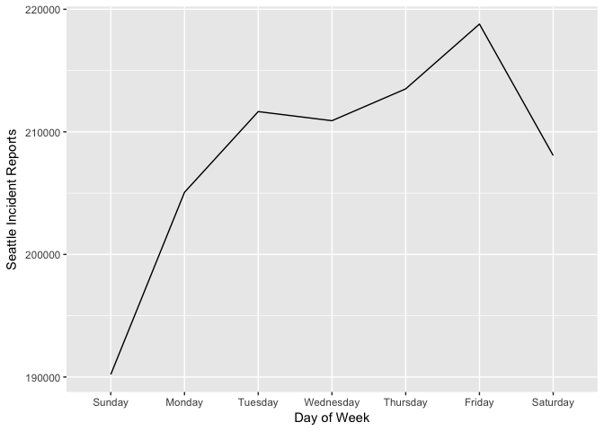
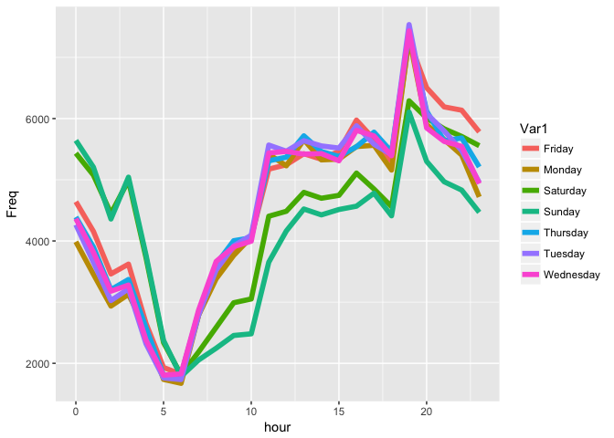
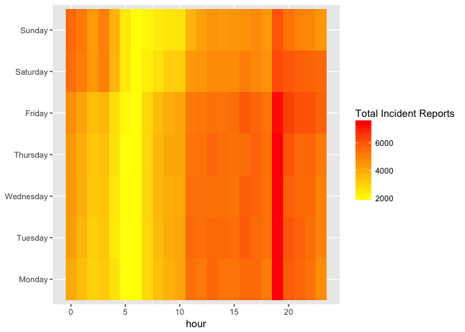
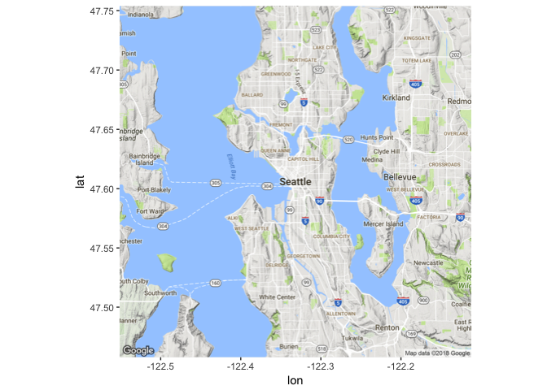
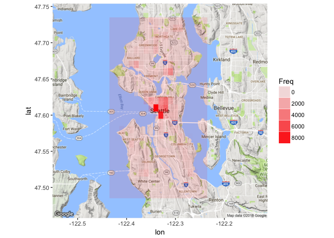
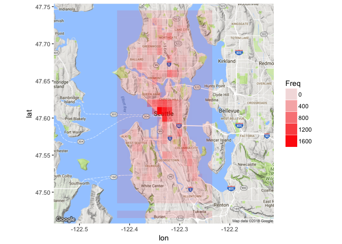
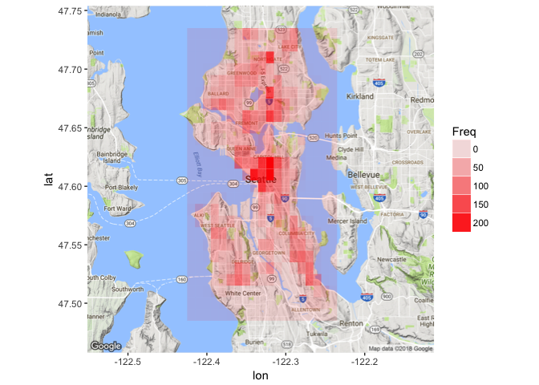
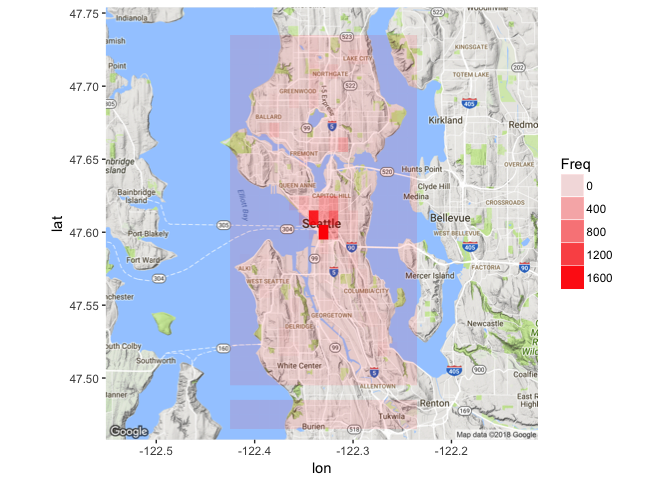

**Load Dataset**


```r
getwd()
```

```
## [1] "/Users/esther/Desktop"
```

```r
setwd('/Users/esther/Desktop')
seattle = read.csv("Seattle_Police_Department_911_Incident_Response.csv", stringsAsFactors = FALSE)
```

**Learn the structure of the data**

```r
str(seattle)
```

```
## 'data.frame':	1466787 obs. of  19 variables:
##  $ CAD.CDW.ID                 : chr  "15736" "15737" "15738" "15739" ...
##  $ CAD.Event.Number           : num  1e+10 1e+10 1e+10 1e+10 1e+10 ...
##  $ General.Offense.Number     : num  2.01e+09 2.01e+09 2.01e+09 2.01e+09 2.01e+09 ...
##  $ Event.Clearance.Code       : chr  "242" "065" "250" "460" ...
##  $ Event.Clearance.Description: chr  "FIGHT DISTURBANCE" "THEFT - MISCELLANEOUS" "MISCHIEF, NUISANCE COMPLAINTS" "TRAFFIC (MOVING) VIOLATION" ...
##  $ Event.Clearance.SubGroup   : chr  "DISTURBANCES" "THEFT" "NUISANCE, MISCHIEF COMPLAINTS" "TRAFFIC RELATED CALLS" ...
##  $ Event.Clearance.Group      : chr  "DISTURBANCES" "OTHER PROPERTY" "NUISANCE, MISCHIEF " "TRAFFIC RELATED CALLS" ...
##  $ Event.Clearance.Date       : chr  "07/17/2010 08:49:00 PM" "07/17/2010 08:50:00 PM" "07/17/2010 08:55:00 PM" "07/17/2010 09:00:00 PM" ...
##  $ Hundred.Block.Location     : chr  "3XX BLOCK OF PINE ST" "36XX BLOCK OF DISCOVERY PARK BLVD" "21XX BLOCK OF 3RD AVE" "7XX BLOCK OF ROY ST" ...
##  $ District.Sector            : chr  "M" "Q" "M" "D" ...
##  $ Zone.Beat                  : chr  "M2" "Q1" "M2" "D1" ...
##  $ Census.Tract               : chr  "8100.2001" "5700.1012" "7200.2025" "7200.1002" ...
##  $ Longitude                  : num  -122 -122 -122 -122 -122 ...
##  $ Latitude                   : num  47.6 47.7 47.6 47.6 47.6 ...
##  $ Incident.Location          : chr  "(47.610975163, -122.338146748)" "(47.658324899, -122.404612874)" "(47.613551471, -122.342843234)" "(47.625401388, -122.341846999)" ...
##  $ Initial.Type.Description   : chr  "" "" "" "" ...
##  $ Initial.Type.Subgroup      : chr  "" "" "" "" ...
##  $ Initial.Type.Group         : chr  "" "" "" "" ...
##  $ At.Scene.Time              : chr  "" "" "" "" ...
```

```r
names(seattle)
```

```
##  [1] "CAD.CDW.ID"                  "CAD.Event.Number"           
##  [3] "General.Offense.Number"      "Event.Clearance.Code"       
##  [5] "Event.Clearance.Description" "Event.Clearance.SubGroup"   
##  [7] "Event.Clearance.Group"       "Event.Clearance.Date"       
##  [9] "Hundred.Block.Location"      "District.Sector"            
## [11] "Zone.Beat"                   "Census.Tract"               
## [13] "Longitude"                   "Latitude"                   
## [15] "Incident.Location"           "Initial.Type.Description"   
## [17] "Initial.Type.Subgroup"       "Initial.Type.Group"         
## [19] "At.Scene.Time"
```


```r
head(seattle)
```

```
##   CAD.CDW.ID CAD.Event.Number General.Offense.Number Event.Clearance.Code
## 1      15736      10000246357             2010246357                  242
## 2      15737      10000246471             2010246471                  065
## 3      15738      10000246255             2010246255                  250
## 4      15739      10000246473             2010246473                  460
## 5      15740      10000246330             2010246330                  250
## 6      15741      10000246477             2010246477                  281
##     Event.Clearance.Description      Event.Clearance.SubGroup
## 1             FIGHT DISTURBANCE                  DISTURBANCES
## 2         THEFT - MISCELLANEOUS                         THEFT
## 3 MISCHIEF, NUISANCE COMPLAINTS NUISANCE, MISCHIEF COMPLAINTS
## 4    TRAFFIC (MOVING) VIOLATION         TRAFFIC RELATED CALLS
## 5 MISCHIEF, NUISANCE COMPLAINTS NUISANCE, MISCHIEF COMPLAINTS
## 6            SUSPICIOUS VEHICLE      SUSPICIOUS CIRCUMSTANCES
##      Event.Clearance.Group   Event.Clearance.Date
## 1             DISTURBANCES 07/17/2010 08:49:00 PM
## 2           OTHER PROPERTY 07/17/2010 08:50:00 PM
## 3      NUISANCE, MISCHIEF  07/17/2010 08:55:00 PM
## 4    TRAFFIC RELATED CALLS 07/17/2010 09:00:00 PM
## 5      NUISANCE, MISCHIEF  07/17/2010 09:00:00 PM
## 6 SUSPICIOUS CIRCUMSTANCES 07/17/2010 09:02:00 PM
##              Hundred.Block.Location District.Sector Zone.Beat Census.Tract
## 1              3XX BLOCK OF PINE ST               M        M2    8100.2001
## 2 36XX BLOCK OF DISCOVERY PARK BLVD               Q        Q1    5700.1012
## 3             21XX BLOCK OF 3RD AVE               M        M2    7200.2025
## 4               7XX BLOCK OF ROY ST               D        D1    7200.1002
## 5             9XX BLOCK OF ALOHA ST               D        D1    6700.1009
## 6    30XX BLOCK OF W GOVERNMENT WAY               Q        Q1    5700.2005
##   Longitude Latitude              Incident.Location
## 1 -122.3381 47.61098 (47.610975163, -122.338146748)
## 2 -122.4046 47.65832 (47.658324899, -122.404612874)
## 3 -122.3428 47.61355 (47.613551471, -122.342843234)
## 4 -122.3418 47.62540 (47.625401388, -122.341846999)
## 5 -122.3397 47.62742 (47.627424837, -122.339708605)
## 6 -122.3966 47.66131   (47.66131158, -122.39662681)
##   Initial.Type.Description Initial.Type.Subgroup Initial.Type.Group
## 1                                                                  
## 2                                                                  
## 3                                                                  
## 4                                                                  
## 5                                                                  
## 6                                                                  
##   At.Scene.Time
## 1              
## 2              
## 3              
## 4              
## 5              
## 6
```

**Manipulate column for Time-Series Analysis**

This was the most challenging part of the project for me. After many attempts to manipulate the Event.Clearnance.Date column, I learned that it was the easiest to convert the column to dtype= *POSIXct* first. After doing so, the operation of retrieving the weekdays, hour, year, months becomes feasible. 


```r
seattle$Event.Clearance.Date = as.POSIXct(seattle$Event.Clearance.Date, format="%m/%d/%Y %I:%M:%S %p", tz="")
```


```r
seattle$weekday = weekdays(seattle$Event.Clearance.Date)
table(seattle$weekday)
```

```
## 
##    Friday    Monday  Saturday    Sunday  Thursday   Tuesday Wednesday 
##    218794    205069    208073    190207    213509    211654    210911
```


```r
seattle$hours = strftime(seattle$Event.Clearance.Date, format= "%H")
table(seattle$hours)
```

```
## 
##    00    01    02    03    04    05    06    07    08    09    10    11 
## 66615 60014 50205 50271 40838 27565 24173 33452 42186 47222 49716 64631 
##    12    13    14    15    16    17    18    19    20    21    22    23 
## 68529 71535 70170 72430 75048 74150 68696 90416 82729 78262 77551 71813
```


```r
wkday = as.data.frame(table(seattle$weekday))
str(wkday)
```

```
## 'data.frame':	7 obs. of  2 variables:
##  $ Var1: Factor w/ 7 levels "Friday","Monday",..: 1 2 3 4 5 6 7
##  $ Freq: int  218794 205069 208073 190207 213509 211654 210911
```

```r
library(ggplot2)
wkday$Var1= factor(wkday$Var1, ordered=TRUE, levels = c("Sunday", "Monday", "Tuesday", "Wednesday", "Thursday", "Friday", "Saturday"))

ggplot(wkday, aes(x=Var1, y=Freq)) + geom_line(aes(group=1)) + xlab("Day of Week") + ylab("Seattle Incident Reports") 
```

<!-- -->

**Counting Incidents by Years**

It's clear that there are missing data for yrs: 2013 and 2014. 
I reached out to the city of Seattle, and I'm waiting for a response..


```r
seattle$year = strftime(seattle$Event.Clearance.Date, format= "%Y")
table(seattle$year)
```

```
## 
##   2009   2010   2011   2012   2013   2014   2015   2016   2017   2018 
##     23 127957 228065 255833  37304   1157 234749 254606 258966  59557
```

**Filter to last 3 years**

The data has been filtered down to incident reports within the last 3 years: 2015, 2016, 2017


```r
#filtering to past 3 yrs
seattle3 = seattle[seattle$year %in% c(2015, 2016, 2017), ]
#sort(table(seattle2$Event.Clearance.SubGroup), decreasing=T)
weekdayHr3 = as.data.frame(table(seattle3$weekday, seattle3$hours))
str(weekdayHr3)
```

```
## 'data.frame':	168 obs. of  3 variables:
##  $ Var1: Factor w/ 7 levels "Friday","Monday",..: 1 2 3 4 5 6 7 1 2 3 ...
##  $ Var2: Factor w/ 24 levels "00","01","02",..: 1 1 1 1 1 1 1 2 2 2 ...
##  $ Freq: int  4641 3987 5434 5643 4391 4266 4364 4157 3456 5076 ...
```

```r
weekdayHr3$hour = as.numeric(as.character(weekdayHr3$Var2))
ggplot(weekdayHr3, aes(x=hour, y=Freq)) + geom_line(aes(group=Var1, color=Var1), size=2)
```

<!-- -->

**Heatmap for Weekday/Hour**


```r
weekdayHr3$Var1 = factor(wkday$Var1, ordered=TRUE, levels = c("Monday", "Tuesday", "Wednesday", "Thursday", "Friday", "Saturday", "Sunday"))

ggplot(weekdayHr3, aes(x=hour, y=Var1)) + geom_tile(aes(fill=Freq)) + scale_fill_gradient(name="Total Incident Reports", low="yellow", high="red") + theme(axis.title.y= element_blank())
```

<!-- -->

**Investigate columns: Event.Clearance.Group**

Each report is stored filed in the hierarchy format below:

    * GROUP -- Event.Clearance.Group
    * SUBGROUP -- Event.Clearance.SubGroup
    * DESCRIPTION -- Event.Clearance.Description
    
**Sort Incident Reports by Main Group, highest to lowest**

```r
sort(table(seattle3$Event.Clearance.Group), decreasing=T)
```

```
## 
##                 TRAFFIC RELATED CALLS 
##                                133250 
##                          DISTURBANCES 
##                                107426 
##              SUSPICIOUS CIRCUMSTANCES 
##                                104086 
## MOTOR VEHICLE COLLISION INVESTIGATION 
##                                 44614 
##                     LIQUOR VIOLATIONS 
##                                 37870 
##                              TRESPASS 
##                                 30034 
##                             CAR PROWL 
##                                 26856 
##                          FALSE ALACAD 
##                                 26795 
##                    NUISANCE, MISCHIEF 
##                                 24224 
##                           SHOPLIFTING 
##                                 22797 
##                              BURGLARY 
##                                 22061 
##                        OTHER PROPERTY 
##                                 19640 
##                           AUTO THEFTS 
##                                 15509 
##                              ASSAULTS 
##                                 13676 
##                     BEHAVIORAL HEALTH 
##                                 13552 
##                  NARCOTICS COMPLAINTS 
##                                 12404 
##                       PROPERTY DAMAGE 
##                                 12010 
##                               HAZARDS 
##                                 11989 
##                          FALSE ALARMS 
##                                  9680 
##             PROPERTY - MISSING, FOUND 
##                                  9534 
##                           FRAUD CALLS 
##                                  8988 
##                   THREATS, HARASSMENT 
##                                  7776 
##                                ARREST 
##                                  4558 
##                    PERSON DOWN/INJURY 
##                                  4319 
##                               ROBBERY 
##                                  4110 
##            MISCELLANEOUS MISDEMEANORS 
##                                  3737 
##        PERSONS - LOST, FOUND, MISSING 
##                                  3265 
##                                  BIKE 
##                                  2598 
##                          LEWD CONDUCT 
##                                  2053 
##                     ANIMAL COMPLAINTS 
##                                  2007 
##                         WEAPONS CALLS 
##                                  1959 
##                               PROWLER 
##                                  1189 
##                          PROSTITUTION 
##                                  1021 
##                          HARBOR CALLS 
##                                   699 
##    FAILURE TO REGISTER (SEX OFFENDER) 
##                                   594 
##                     PUBLIC GATHERINGS 
##                                   413 
##                  DRIVE BY (NO INJURY) 
##                                   329 
##                         MENTAL HEALTH 
##                                   241 
##                            OTHER VICE 
##                                   187 
##                      RECKLESS BURNING 
##                                   147 
##                              HOMICIDE 
##                                    80 
##                ACCIDENT INVESTIGATION 
##                                    35 
##                            VICE CALLS 
##                                     9
```

**Mapping Regions of Seattle in Relation to Incident Groups **

**1. TRAFFIC RELATED CALLS**


```r
#tapply(seattle3$Event.Clearance.SubGroup)
tapply( seattle3$Event.Clearance.Group=='TRAFFIC RELATED CALLS',seattle3$year, sum)
```

```
##  2015  2016  2017 
## 42059 44575 46616
```


```r
traffic = seattle3[seattle3$Event.Clearance.Group=='TRAFFIC RELATED CALLS',]
```

Below are descriptions of TRAFFIC RELATED CALLS:

```r
sort(table(traffic$Event.Clearance.Description), decreasing=TRUE)
```

```
## 
## PARKING VIOLATION (EXCEPT ABANDONED VEHICLES) 
##                                         55468 
##                    TRAFFIC (MOVING) VIOLATION 
##                                         51329 
##           DRIVING WHILE UNDER INFLUENCE (DUI) 
##                                          9826 
##                              BLOCKING VEHICLE 
##                                          6389 
##                               MOTORIST ASSIST 
##                                          3643 
##                             ABANDONED VEHICLE 
##                                          3339 
##                          PEDESTRIAN VIOLATION 
##                                          2807 
##   TRAFFIC - COMMUNITY TRAFFIC COMPLAINT (CTC) 
##                                           165 
##                   TRAFFIC - BICYCLE VIOLATION 
##                                           124 
##                                       PURSUIT 
##                                            75 
##             TRAFFIC - SCHOOL ZONE ENFORCEMENT 
##                                            52 
##              TRAFFIC CONTROL (SPECIAL EVENTS) 
##                                            33
```


```r
library(ggmap)
library(maps)
seattle_map= get_map(location= "seattle", zoom=11)
```

```
## Map from URL : http://maps.googleapis.com/maps/api/staticmap?center=seattle&zoom=11&size=640x640&scale=2&maptype=terrain&language=en-EN&sensor=false
```

```
## Information from URL : http://maps.googleapis.com/maps/api/geocode/json?address=seattle&sensor=false
```

```r
ggmap(seattle_map)
```

<!-- -->


**Build function that can be used to map other incident groups**


```r
map <- function(x)
   { ll <- as.data.frame(table(round(x$Longitude,2),  round(x$Latitude,2)))
    ll$long <- as.numeric(as.character(ll$Var1))
    ll$lat <- as.numeric(as.character(ll$Var2))
    ggmap(seattle_map) + geom_tile(data=ll, aes(x=long, y=lat, alpha=Freq) , fill="red")
}

mapT= map(traffic)
mapT
```

```
## Warning: Removed 44 rows containing missing values (geom_tile).
```

<!-- -->


**2. DISTURBANCES**


```r
disturbances = seattle3[seattle3$Event.Clearance.Group=='DISTURBANCES',]
nrow(disturbances)
```

```
## [1] 107426
```

```r
table(disturbances$Event.Clearance.Description)
```

```
## 
##      DISTURBANCE, GANG RELATED             DISTURBANCE, OTHER 
##                             15                          79897 
##              FIGHT DISTURBANCE           JUVENILE DISTURBANCE 
##                           6198                            414 
##              NOISE DISTURBANCE NOISE DISTURBANCE, RESIDENTIAL 
##                          16345                           4557
```


```r
mapD= map(disturbances)
mapD
```

<!-- -->
 
**3. SUSPICIOUS CIRCUMSTANCES**


```r
suspicious = seattle3[seattle3$Event.Clearance.Group=='SUSPICIOUS CIRCUMSTANCES',]
table(suspicious$Event.Clearance.Description)
```

```
## 
## SUSPICIOUS CIRCUMSTANCES - BUILDING (OPEN DOOR, ETC.) 
##                                                  5082 
##                                     SUSPICIOUS PERSON 
##                                                 76934 
##                                    SUSPICIOUS VEHICLE 
##                                                 22070
```


```r
mapS= map(suspicious)
mapS
```

```
## Warning: Removed 84 rows containing missing values (geom_tile).
```

<!-- -->
 
**4. MOTOR VEHICLE COLLISION INVESTIGATION**
    

```r
collision = seattle3[seattle3$Event.Clearance.Group=='MOTOR VEHICLE COLLISION INVESTIGATION',]
nrow(collision)
```

```
## [1] 44614
```

```r
table(collision$year)
```

```
## 
##  2015  2016  2017 
##  9304 18019 17291
```

```r
mapC= map(collision)
mapC
```

<!-- -->

**Mapping Auto Thefts**

```r
auto= seattle3[seattle3$Event.Clearance.Group=='AUTO THEFTS',]
table(auto$Event.Clearance.Description)
```

```
## 
##           AUTO RECOVERY              AUTO THEFT AUTO THEFT AND RECOVERY 
##                    2727                   11762                    1020
```

```r
auto_thefts=auto[auto$Event.Clearance.Description=='AUTO THEFT',]
```


```r
mapAT= map(auto_thefts)
mapAT
```

<!-- -->

**Mapping Assaults**


```r
assaults = seattle3[seattle3$Event.Clearance.Group=='ASSAULTS',]
table(assaults$Event.Clearance.Description)
```

```
## 
## ASSAULTS, FIREARM INVOLVED     ASSAULTS, GANG RELATED 
##                        420                         27 
##            ASSAULTS, OTHER 
##                      13229
```


```r
mapA = map(assaults)
mapA
```

<!-- -->

